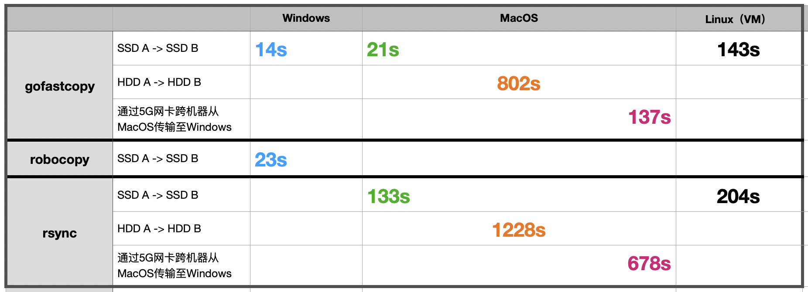

# gofastcopy

批量复制大量小文件的加速工具，速度快于 `rsync` 、 `robocopy`

`gofastcopy` 同时支持在 `Linux`、`MacOS`、`Windows`三个平台运行

## 原理
利用CPU多核并行、SSD并行读写的特性，在内存中建立2个分开运行的队列，一个队列持续从源文件夹中读取小文件存入内存，一个队列不断写入文件到目标文件夹。

## 场景
跨磁盘、跨机器，复制大量小文件，作为 `rsync` 或 `robocopy` 的另外一个选择，读取队列无需等待排队，写入队列极快，只要内存中有文件，即会落盘；

在文件中大多数小于`16MB`时，相较于 `rsync` 较为有速度优势；

读取队列会提前预读文件内容到内存中，写入队列可以节省文件数据的读取时间，当小文件数量到达`10W`以上时，这个累计时间较为客观；




## `gofastcopy` 性能更好

在`Mac mini M4`上：

1）同一块固态盘内复制: 固态到固态

从SSD移动硬盘文件夹A复制到同一块SSD移动硬盘文件夹B：

```Python
rsync 需要 261 秒，
gofastcopy 需要 135 秒，快了 126 秒
#
# 数据：12，221个文件， 33，698 MB
```

2）同一块机械硬盘内复制：机械到机械

从机械移动硬盘文件夹A复制到同一块机械移动硬盘文件夹B：

```Python
rsync 需要 1025 秒，
gofastcopy 需要 797 秒，快了 228 秒
#
# 数据：8，878个文件，21，147 MB
```


在`Windows`上：

1）跨盘复制，固态到固态：

```Python
robocopy 需要 92 秒，
gofastcopy 需要 83 秒， 快了 9 秒
#
# 数据：46，786个文件，116.69GB，从固态A(宏碁GM7，PCIe 4.0）拷贝到固态B(SanDisk，PCIe 3.0）
```

## 性能更差

1）跨盘复制，机械到固态

在`Mac mini M4`上，从HDD移动机械硬盘复制到SSD移动硬盘, 默认的并行模式性能更差：

解决方案： 使用 `--serial` 加速

```Python
# 数据：8，878个文件，21，147 MB
#
rsync 需要 277 秒，
gofastcopy 需要 344 秒，慢了 67 秒
#
# 如何优化？
# 加上 --serial 参数，复制模式由默认的固态擅长的并行模式改为传统的 串行 模式：
#
gofastcopy  --serial 需要 251 秒，比 rsync 快了 26 秒
#
# 为什么机械硬盘上并行会更慢？
# SSD天然更适合并行读取，而机械硬盘只有一个机械臂，物理摆动机械臂效率更低。
# 串行读取文件，机械臂摆动到位置，读完才走，
# 并行读取几十个小文件，机械臂读一点，又要摆动到其他位置读取别的文件，
# 然后又回来读取了一点点又再次离开，再回来再读再离开，无用功线形增加。
# 文件越多、越大，这种无用功增加的绝对时间越长（摆臂次数），
# 依照机械硬盘的特点，使用串行读取，即可避免无用功。
#
# 所以加上 --serial 参数即可明显提速。
#
#
对比测试：279.5GB，98，974个文件
# ./gofastcopy 
# 加上 --serial 参数， 耗时 2790 秒
# 不加 --serial 参数， 耗时 4619 秒, 多了 1829 秒（即30分钟）
# 而用 rsync ，耗时 3403 秒, 多了 613 秒（即10分钟）
# 
#
```


## Usage
### 打开终端，运行
```Python

./gofastcopy --source-dir="/path/to/source" --target-dir="/path/to/target"

# --debug 默认 false ： 是否显示各种调试信息
# --dry-run 默认 false ： 设置为 true 时，仅在控制台窗口显示将会复制的文件，不会实际写入文件
#
# --source-dir 默认为 空 ： 源文件夹
# --target-dir 默认为 空 ： 复制到的目标文件夹
# --exclude-dir 默认为 空 ： 如果该文件夹中存在同路径文件，该文件将被排除
# --ext 默认为 空 ：譬如，设置为 .mp4 ，则仅复制 mp4 文件，设置为 .(mp4|txt|pdf|png) ，则仅复制指定的这4种后缀名的文件
#
# --min-size 默认为 -1 ：文件大小【小于】该值的文件将被忽略
# --max-size 默认为 -1 ： 文件大小【大于】该值的文件将被忽略
#
# --min-size-mb 默认为 -1 ：用MB单位设置【最小】文件大小，会覆盖--min-size的值，譬如设置为16，即自动将--min-size=16*1024*1024
# --max-size-mb 默认为 -1 ：用MB单位设置【最大】文件大小，会覆盖--max-size的值，譬如设置为100，即自动将--max-size=100*1024*1024
#
# --min-age 默认为 空 ： 文件最后修改时间【早于】该值的文件将被忽略
# --max-age 默认为 空 ：文件最后修改时间【晚于】该值的文件将被忽略
#
# --ignore-dot-file 默认为 true ： 是否忽略点（.）开头的文件
# --ignore-empty-folder 默认为 true ：是否忽略空文件夹
# --overwrite 默认为 false ： 是否允许覆盖已经存在的文件
# --purge 默认为 false ： 是否删除目标文件夹中存在但源文件夹中不存在的文件，即是否清理目标文件夹中多余的文件
#
# --with-limit-memory 默认为 false ： 低内存模式，并行任务固定为 4.
# --with-time-utc 默认为 false ： max-age/min-age 比较时间时，默认使用本地时间，如果要使用UTC时区时间，此项设置为 true
#
# --threads 默认为 0（即自动计算）：强制指定并行线程数，默认线程数限制在32～128之间，该参数可以无限制强制指定线程数
# --serial  默认为 false ：将文件复制模式由默认的并行改为传统的串行模式，在机械硬盘上速度更快 
#
#

